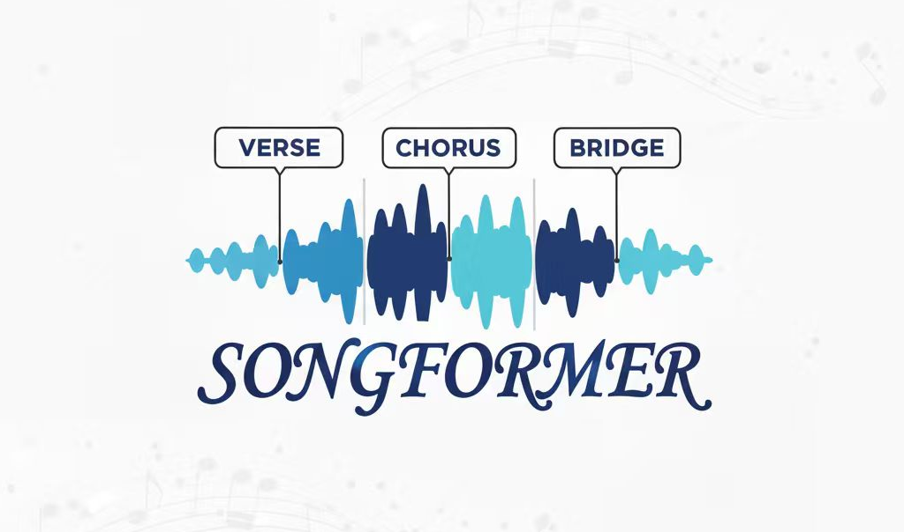
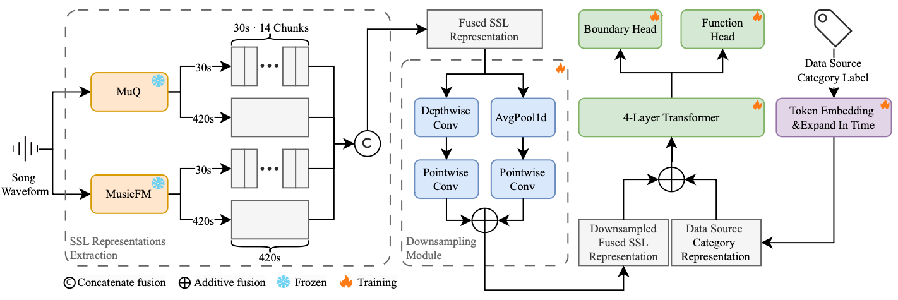

<p align="center">
  
</p>

<h1 align="center">SongFormer: Scaling Music Structure Analysis with Heterogeneous Supervision</h1>

<div align="center">

<div style="text-align: center;">
    
    
  <a href="https://arxiv.org/abs/2510.02797">
    
  </a>
  <a href="https://github.com/ASLP-lab/SongFormer">
    
  </a>
  <a href="https://huggingface.co/spaces/ASLP-lab/SongFormer">
    
  </a>
  <a href="https://huggingface.co/ASLP-lab/SongFormer">
    
  </a>
  <a href="https://huggingface.co/datasets/ASLP-lab/SongFormDB">
    
  </a>
  <a href="https://huggingface.co/datasets/ASLP-lab/SongFormBench">
    
  </a>
  <a href="https://discord.gg/p5uBryC4Zs">
    
  </a>
  <a href="http://www.npu-aslp.org/">
    
  </a>
</div>

</div>

<div align="center">
  <h3>
    Chunbo Hao<sup>1*</sup>, Ruibin Yuan<sup>2,6*</sup>, Jixun Yao<sup>1</sup>, Qixin Deng<sup>3,6</sup>,<br>Xinyi Bai<sup>4,6</sup>, Yanbo Wang<sup>5</sup>, Wei Xue<sup>2</sup>, Lei Xie<sup>1†</sup>
  </h3>


  <p>
    <sup>*</sup>Equal contribution &nbsp;&nbsp; <sup>†</sup>Corresponding author
  </p>
  <p>
    <sup>1</sup>Audio, Speech and Language Processing Group (ASLP@NPU),<br>School of Computer Science, Northwestern Polytechnical University<br>
    <sup>2</sup>Hong Kong University of Science and Technology<br>
    <sup>3</sup>Northwestern University<br>
    <sup>4</sup>Cornell University<br>
    <sup>5</sup>University of New South Wales<br>
    <sup>6</sup>Multimodal Art Projection (M-A-P)
  </p>

</div>

----
[ [English](README.md) ｜ 中文 ]

SongFormer 是一种音乐结构分析框架，利用多分辨率的自监督表示和异构监督策略，配套发布大规模多语言数据集 SongFormDB 以及高质量基准 SongFormBench，旨在推动音乐结构分析领域的公平与可复现研究。



## 📢 最新动态

🔥 **2025年10月3日**
**开源训练与评估代码** – 我们已发布完整的训练和评估代码，以支持社区发展和进一步研究。

🔥 **2025年10月2日**
**上线 Hugging Face 一键推理功能** – 已成功在 Hugging Face 平台部署 SongFormer 的一键推理功能，使模型测试与使用更加便捷易用。

🔥 **2025年9月30日**
**发布 SongFormer 推理包** – SongFormer 的完整推理代码和预训练模型Checkpoint现已公开发布，可供下载和使用。

🔥 **2025年9月26日**  
**SongFormDB 与 SongFormBench 发布** – 我们推出了大规模音乐数据集 **SongFormDB** 和综合基准测试套件 **SongFormBench**，两者现已在 Hugging Face 上线，以促进音乐结构分析领域的研究与评估。

## 🚀 快速开始

该模型支持 Hugging Face 的 from_pretrained 方法。要快速开始使用此代码，您需要完成以下两件事：

1. 按照 `设置 Python 环境` 中的说明配置您的 Python 环境
2. 访问我们的 [Hugging Face 模型页面](https://huggingface.co/ASLP-lab/SongFormer)，并运行 README 中提供的代码

## 🌟 主要亮点

我们在音乐结构分析方面实现了**突破性的性能**，全面树立了新的基准：

- ✨ 对西方和华语音乐数据集均实现了**最先进的准确性**
- ⚡ **飞快的推理速度**——超过同类模型
- 💰 **高性价比**——无需API费用，仅需单块GPU在本地运行

### ⏱️ 速度对比

**整首歌曲处理仅需2-4秒！** 以下是我们的对比表现：

| 模型                   | 处理时间     | 备注            |
| --------------------- | ------------ | --------------- |
| **🏆 SongFormer (我们)** | **2-4秒**     |                 |
| LinkSeg-7Labels        | 3-5秒        |                 |
| All-In-One             | 9-12秒       |                 |
| SongPrep Fine-tuned    | 9-12秒       |                 |
| SongPrep End2End       | 22-26秒      | 包含歌词         |
| Gemini 2.5 Pro         | 30-90秒      | 包含歌词         |

*测试环境：NVIDIA L40 GPU（不含模型加载时间）*

### 📊 性能指标

- **ACC**：整体边界检测准确率
- **HR.5F**：0.5秒容忍度下的命中率（细粒度精度）
- **HR3F**：3秒容忍度下的命中率

#### SongFormBench-HarmonixSet

| 方法                   | ACC       | HR.5F     | HR3F      |
| ----------------------- | --------- | --------- | --------- |
| **基线方法**            |           |           |           |
| Harmonic-CNN*           | 0.680     | 0.559     | —         |
| SpecTNT (24s)*          | 0.701     | 0.570     | —         |
| SpecTNT (36s)*          | 0.723     | 0.558     | —         |
| All-In-One              | 0.740     | 0.596     | 0.730     |
| MERT (5s)*              | 0.574     | 0.626     | —         |
| MusicFM-Zhang 等人*     | 0.725     | 0.640     | 0.729     |
| MuQ_iter*               | 0.772     | —         | —         |
| LinkSeg-7Labels         | 0.780     | 0.630     | 0.762     |
| TA (Zhang 等人，2025)* | 0.787     | 0.610     | 0.801     |
| Gemini 2.5 Pro          | 0.748     | 0.423     | **0.813** |
| **SongFormer**    |           |           |           |
| SongFormer (HX)         | 0.795     | **0.703** | 0.784     |
| SongFormer (HX+E+H)      | 0.806     | 0.697     | 0.780     |
| SongFormer (HX+E+H+G)    | **0.807** | 0.696     | 0.780     |

#### SongFormBench-CN

| 方法                   | ACC       | HR.5F     | HR3F      |
| ----------------------- | --------- | --------- | --------- |
| **基线方法**            |           |           |           |
| All-In-One              | 0.834     | 0.563     | 0.771     |
| LinkSeg-7Labels         | 0.828     | 0.518     | 0.757     |
| Gemini 2.5 Pro          | 0.806     | 0.412     | 0.833     |
| **SongFormer**    |           |           |           |
| SongFormer (HX)         | 0.848     | 0.675     | **0.856** |
| SongFormer (HX+E+H)   | 0.890     | **0.690** | 0.852     |
| SongFormer (HX+E+H+G) | **0.891** | 0.688     | 0.851     |


#### RWC-Pop

| 方法                   | ACC       | HR.5F     | HR3F      |
| ------------------------ | --------- | --------- | --------- |
| **基线方法**     |           |           |           |
| Harmonic-CNN*            | 0.646     | 0.571     | —         |
| SpecTNT (24 s, CTL)*     | 0.675     | 0.623     | —         |
| MusicFM-Zhang et al.*    | 0.680     | 0.636     | 0.764     |
| LinkSeg                  | 0.747     | 0.648     | 0.786     |
| TA (Zhang et al., 2025)* | 0.779     | 0.506     | 0.691     |
| **SongFormer**    |           |           |           |
| SongFormer (HX)          | 0.787     | **0.651** | 0.795     |
| SongFormer (HX+E+H)      | **0.814** | 0.650     | **0.804** |
| SongFormer (HX+E+H+G)    | 0.812     | 0.650     | 0.800     |

- 标记 * 的结果因无法获取实现而引自原论文
- 数据集缩写：HX（HarmonixSet），E、H、G指代论文中所述的不同训练数据集


## 安装

### 设置 Python 环境

```bash
git clone https://github.com/ASLP-lab/SongFormer.git

# 获取 MuQ 和 MusicFM 源码
git submodule update --init --recursive

conda create -n songformer python=3.10 -y
conda activate songformer
```

中国大陆用户建议配置 pip 镜像源：

```bash
pip config set global.index-url https://pypi.mirrors.ustc.edu.cn/simple
```

安装依赖项：

```bash
pip install -r requirements.txt
```

本项目在 Ubuntu 22.04.1 LTS 上测试通过。若安装失败，可尝试移除 `requirements.txt` 中的部分版本限制。

### 下载预训练模型

```bash
cd src/SongFormer
# 中国大陆用户可根据 py 文件说明修改为 hf-mirror.com 下载
python utils/fetch_pretrained.py
```

下载完成后，可通过以下命令核对 `src/SongFormer/ckpts/md5sum.txt` 中的 MD5 值是否一致：

```bash
md5sum ckpts/MusicFM/msd_stats.json
md5sum ckpts/MusicFM/pretrained_msd.pt
md5sum ckpts/SongFormer.safetensors
# md5sum ckpts/SongFormer.pt
```

## 推理

### 1. 使用 HuggingFace Space 一键推理

访问地址：[https://huggingface.co/spaces/ASLP-lab/SongFormer](https://huggingface.co/spaces/ASLP-lab/SongFormer)

### 2. Gradio 应用

首先切换到项目根目录并激活环境：

```bash
conda activate songformer
```

可按需修改 `app.py` 文件最后一行的服务器端口和监听地址。

> 若使用 HTTP 代理，请确保设置以下环境变量：
>
> ```bash
> export no_proxy="localhost, 127.0.0.1, ::1"
> export NO_PROXY="localhost, 127.0.0.1, ::1"
> ```
>
> 否则 Gradio 可能误判服务未启动，导致程序直接退出。

首次运行 `app.py` 时，会连接 Hugging Face 下载 MuQ 相关权重。建议创建一个空文件夹并通过 `export HF_HOME=XXX` 指向该路径，以便统一管理缓存，便于清理和迁移。

中国大陆用户建议设置：`export HF_ENDPOINT=https://hf-mirror.com`，详情见 https://hf-mirror.com/

```bash
python app.py
```

### 3. Python 代码调用

可参考 `src/SongFormer/infer/infer.py` 文件，对应执行脚本为 `src/SongFormer/infer.sh`。这是一个即开即用的单机多进程标注脚本。

以下是 `src/SongFormer/infer.sh` 脚本中一些可配置参数，可通过设置 `CUDA_VISIBLE_DEVICES` 指定使用的 GPU：

```bash
-i              # 输入SCP文件夹路径，每行包含一个音频文件的绝对路径
-o              # 输出结果目录
--model         # 使用的标注模型，默认为 'SongFormer'，若使用微调模型可在此修改
--checkpoint    # 模型Checkpoint路径
--config_pat    # 配置文件路径
-gn             # 使用的GPU总数 — 应与 CUDA_VISIBLE_DEVICES 中指定的数量一致
-tn             # 每个GPU上运行的进程数
```

可通过设置 `CUDA_VISIBLE_DEVICES` 环境变量控制使用哪些 GPU。

> 注意事项
> - 可能需要修改 `src/third_party/musicfm/model/musicfm_25hz.py` 第121行代码为：
> `S = torch.load(model_path, weights_only=False)["state_dict"]`

## 评估

### 1. 准备 MSA TXT 格式的标注与推理结果

MSA TXT 文件格式如下：

```
start_time_1 label_1
start_time_2 label_2
....
end_time end
```

每行包含两个以空格分隔的元素：

- **第一项**：时间戳（浮点数，单位：秒）
- **第二项**：标签（字符串类型）

**转换说明**：
- **SongFormer 输出结果** 可通过工具脚本 `src/SongFormer/utils/convert_res2msa_txt.py` 进行转换
- **其他工具生成的标注** 需自定义转换为此格式
- 所有 MSA TXT 文件应存放在同一文件夹中，且**文件名需与真实标注（GT）一致**

### 2. 支持的标签及定义

| ID   | 标签         | 描述说明                                                  |
| ---- | ---------- | ------------------------------------------------------------ |
| 0    | intro      | 开头部分，通常出现在歌曲起始，极少出现在中后段 |
| 1    | verse      | 主要叙事段落，旋律相似但歌词不同；情绪平稳，偏叙事性 |
| 2    | chorus     | 高潮部分，高度重复，构成歌曲的记忆点；编曲丰富，情绪高涨 |
| 3    | bridge     | 通常在2-3次副歌后出现一次，提供变化后返回主歌或副歌 |
| 4    | inst       | 纯乐器段落，几乎无或极少人声，偶尔包含语音片段 |
| 5    | outro      | 结尾段落，通常位于歌曲末尾，极少出现在开头或中间 |
| 6    | silence    | 静音段落，通常位于 intro 之前或 outro 之后 |
| 26   | pre-chorus | 主歌与副歌之间的过渡段，加入额外乐器，情绪逐渐增强 |
| -    | end        | 标记歌曲结束的时间戳（非标签类别）           |

**重要说明**：尽管模型输出8个类别，主流评估使用7类标准。在评估时，`pre-chorus` 标签将根据我们的映射规则**统一映射为 `verse`**。

### 3. 执行评估

主评估脚本位于 `src/SongFormer/evaluation/eval_infer_results.py`，可通过 `src/SongFormer/eval.sh` 脚本快速执行评估。

#### 参数说明

| 参数                        | 说明                                                         | 默认设置         |
| --------------------------- | ------------------------------------------------------------ | ---------------- |
| `ann_dir`                   | 真实标注（Ground Truth）目录                                 | 必需             |
| `est_dir`                   | 推理结果目录                                                 | 必需             |
| `output_dir`                | 评估结果输出目录                                             | 必需             |
| `prechorus2what`            | `pre-chorus` 标签映射方式：• `verse`：映射到 verse• `chorus`：映射到 chorus• None：保留原标签 | 映射为 `verse`   |
| `merge_continuous_segments` | 合并连续相同标签的片段                                       | 禁用             |

## 训练

开始之前，请确保已安装必要的依赖项，并正确配置了运行环境。

### 第一步：提取自监督学习（SSL）表示

SSL 表示提取代码位于 `src/data_pipeline` 目录中。首先切换到该目录：

```bash
cd src/data_pipeline
```

对于每首歌曲，您需要提取四种不同的表示：

- **MuQ - 30s**：使用 30 秒窗口的短期特征
- **MuQ - 420s**：使用 420 秒窗口的长期特征
- **MusicFM - 30s**：使用 30 秒窗口的短期特征
- **MusicFM - 420s**：使用 420 秒窗口的长期特征

对于 30 秒的表示，提取过程采用 30 秒的窗口大小和步长（hop size），并在提取后将特征拼接，使其最终序列长度与 420 秒版本一致。

请根据您的环境配置以下脚本，然后运行：

```bash
# MuQ 表示
bash obtain_SSL_representation/MuQ/get_embeddings_30s_wrap420s.sh
bash obtain_SSL_representation/MuQ/get_embeddings.sh

# MusicFM 表示
bash obtain_SSL_representation/MusicFM/get_embeddings_mp_30s_wrap420s.sh
bash obtain_SSL_representation/MusicFM/get_embeddings_mp.sh
```

### 第二步：配置训练参数

编辑 `src/SongFormer/configs/SongFormer.yaml` 文件，设置以下内容：

- `train_dataset`：训练数据集配置
- `eval_dataset`：验证数据集配置
- `args`：模型参数及实验名称

---

针对 `dataset_abstracts` 类，请配置以下参数：

| 参数                   | 说明                                                  |
|------------------------|-------------------------------------------------------|
| `internal_tmp_id`      | 数据集实例的唯一标识符                                |
| `dataset_type`         | 数据集 ID，来自 `src/SongFormer/dataset/label2id.py` 中的 `DATASET_LABEL_TO_DATASET_ID` 映射 |
| `input_embedding_dir`  | 四个 SSL 表示文件夹路径，以空格分隔                   |
| `label_path`           | 包含标签信息的 JSONL 文件路径（参见 [示例格式](https://huggingface.co/datasets/ASLP-lab/SongFormDB/blob/main/data/Gem/SongFormDB-Gem.jsonl)） |
| `split_ids_path`       | 文本文件，每行一个 ID，指定要使用的数据（不在该文件中的 ID 将被忽略） |
| `multiplier`           | 数据均衡因子 —— 重复小数据集以匹配大数据集的规模      |

---

更新 `src/SongFormer/train/accelerate_config/single_gpu.yaml` 中的 accelerate 配置，并相应地配置 `src/SongFormer/train.sh` 脚本：

- 您的 Weights & Biases（wandb）API 密钥
- 其他训练相关设置

### 第三步：启动训练

进入 SongFormer 主目录并运行训练脚本：

```bash
cd src/SongFormer
bash train.sh
```

- 相关的训练仪表板将在 `wandb` 中显示
- 模型检查点（checkpoints）将保存在 `src/SongFormer/output` 目录中

## 引用

如果本项目对您的研究有所帮助，请引用以下内容：

````bibtex
@misc{hao2026songformerscalingmusicstructure,
      title={SongFormer: Scaling Music Structure Analysis with Heterogeneous Supervision}, 
      author={Chunbo Hao and Ruibin Yuan and Jixun Yao and Qixin Deng and Xinyi Bai and Yanbo Wang and Wei Xue and Lei Xie},
      year={2026},
      eprint={2510.02797},
      archivePrefix={arXiv},
      primaryClass={eess.AS},
      url={https://arxiv.org/abs/2510.02797}, 
}
````

## 许可证

本项目代码遵循 **CC-BY-4.0 许可证**开放。

## 联系我们

我们欢迎您的反馈与贡献！可通过以下方式联系我们：

- **报告问题**：发现 Bug 或有建议？请在本 GitHub 仓库中直接提交 Issue，这是追踪和解决问题的最佳方式。
- **加入社区**：如需讨论或实时支持，欢迎加入我们的 Discord 服务器：https://discord.gg/rwcqh7Em

期待您的来信！

<p align="center">
    <a href="http://www.nwpu-aslp.org/">
        
    </a>
</p>
